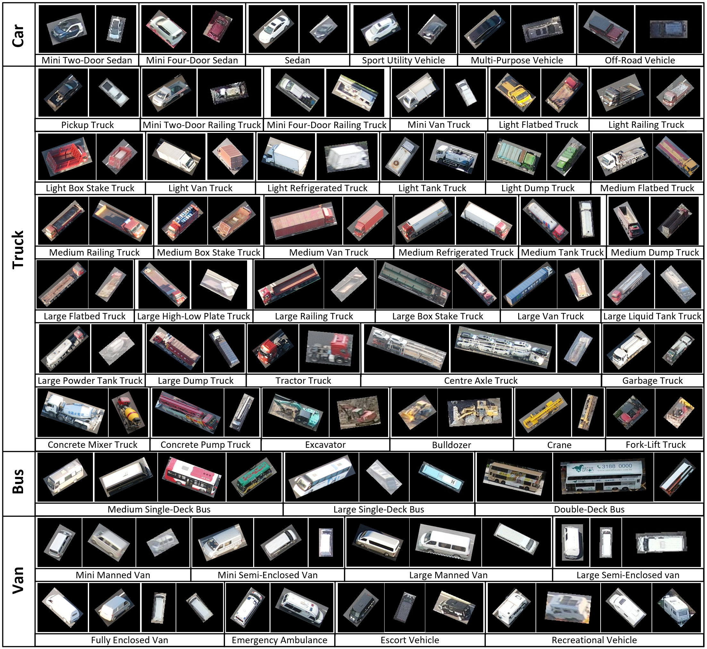

 

<h1>✨DFGOVD✨</h1> 

## Introduction

This is the official implementation of the benchmark of Drone Fine-Grained Oriented Vehicle Detection (DFGOVD). In this paper, we construct DFGOVD, the first large-scale and comprehensive FGOVD dataset for drone-based scenes. The dataset comprises 33,669 images and 816,239 vehicle instances spanning 53 categories and captures subtle distinctions in vehicle appearance, size, and functionality. We benchmark state-of-the-art oriented object detection methods on the DFGOVD dataset, exposing its inherent complexity and challenge.

## Object samples of each category in the DFGOVD dataset

## Results and models
DFGOVD

|        Method                   |  Backbone   | AP50 |AP75 |  AP50:95 |    Aug   |   Batch Size|                                                 Config                                                     |                                                                                                                                                                              Model                                                                                                                                                                              |         log|
| :---------------------------------------: | :---------------: | :-----: | :-----: |:--------: | :-: | :--------: | :------------------------------------------------------------------------------------------------------------: | :----------------------------------------------------------------------------------------------------------------------------------------------------------------------------------------------------------------------------------------------------------------------------------------------------------------------------------------------------------------: |:----------------------------------------------------------------------------------------------------------------------------------------------------------------------------------------------------------------------------------------------------------------------------------------------------------------------------------------------------------------: |
| RetinaNet-O           | R-50-FPN | 53.00   | 48.41 | 40.79 | - |2 |  [rotated_retinanet_obb_r50_fpn_1x_dfgovd_le135]()  |[model]()|[log]()| 
| R3Det      | R-50-FPN | 64.06   | 55.76 | 46.44 | - |2 |  [r3det_tiny_r50_fpn_1x_dfgovd_oc]()  |[model]()|[log]()| 
| S2A-Net    | R-50-FPN | 65.43   | 59.13 | 48.84 | - |2 |  [s2anet_r50_fpn_1x_dfgovd_le135]()  |[model]()|[log]()| 
| FCOS-O                | R-50-FPN | 66.26   | 60.84 | 51.66 | - |2 |  [rotated_fcos_r50_fpn_1x_dfgovd_le90]()  |[model]()|[log]()| 
| Faster R-CNN-O        | R-50-FPN | 69.67   | 59.72 | 49.95 | - |2 |  [rotated_faster_rcnn_r50_fpn_1x_dfgovd_le90]()  |[model]()|[log]()| 
| Gliding Vertex        | R-50-FPN | 70.89   | 60.31 | 50.43 | - |2 |  [gliding_vertex_r50_fpn_1x_dfgovd_le90]()  |[model]()|[log]()| 
| Oriented R-CNN        | R-50-FPN | 72.63   | 66.70 | 55.89 | - |2 |  [oriented_rcnn_r50_fpn_1x_dfgovd_le90]()  |[model]()|[log]()| 
| ReDet                 | ReR-50-ReFPN | 72.87   | 67.15 | 56.19 | - |2 |  [redet_re50_refpn_1x_dfgovd_le90]()  |[model]()|[log]()|  
| RoI Transformer       | R-50-FPN | 74.59   | 67.87 | 56.87 | - |2 |  [roi_trans_r50_fpn_1x_dfgovd_le90]()  |[model]()|[log]()|  
| SFRNet                | R-50-FPN | 75.35   | 69.01 | 58.11 | - |2 |  [sfr_oriented_rcnn_r50_fpn_1x_dfgovd_le90]()  |[model]()|[log]()|  
| DRNet                 | R-50-FPN | 76.49   | 67.36 | 56.75 | - |2 |  [drnet_r50_fpn_1x_dfgovd_le90]()  |[model]()|[log]()| 
| PCLDet                | ReR-50-ReFPN | 76.50   | 70.68 | 58.70 | - |2 |  [con_redet_re50_refpn_1x_dfgovd]()  |[model]()|[log]()| 
| PETDet                | ReR-50-ReFPN | 78.87   | 72.93 | 61.01 | - |2 |  [petdet_r50_fpn_1x_dfgovd_le90]()  |[model]()|[log]()| 
